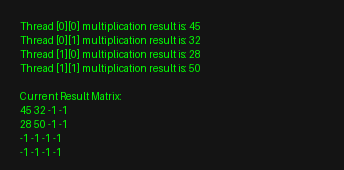

# ⚡ Parallel Matrix Multiplication in C++ (POSIX Threads)

[](LICENSE)


A High-Performance Parallel Computing implementation in C++ that demonstrates matrix multiplication using POSIX Threads (`pthread`). This project showcases multithreading, workload distribution, and computational performance benchmarking.

---

## 📌 Project Overview

Matrix multiplication is a computationally intensive operation with a complexity of $\mathcal{O}(N^3)$. By parallelizing row and column computations across multiple worker threads, this project significantly reduces execution time on multi-core CPU architectures.

### Key Features
- **Multithreaded Execution:** Utilizes POSIX threads (`pthread`) to parallelize row computations.
- **Dynamic Workload Distribution:** Divides matrix rows evenly among available CPU threads.
- **Customizable Dimensions & Thread Counts:** Supports user-defined matrix dimensions and thread configurations.
- **Performance Benchmarking:** Measures execution runtime for parallel performance evaluation.

---

## 📸 Demo & Thread Output

Below is an example execution showing thread allocation and parallel execution output:



---

## 🛠 Project Structure

```text
Parallel-Matrix-Multiplication/
├── parallel_computing.cpp       # Main C++ source code with pthread implementation
├── static/
│   └── screenshots/
│       └── thread-output.png    # Execution screenshot
├── LICENSE                      # MIT License file
└── README.md                    # Project documentation
```
🚀 Getting Started
Prerequisites
To compile and run this project, you need a C++ compiler with pthread support (such as GCC/G++) on a POSIX-compliant environment (Linux, macOS, or WSL on Windows).

- g++ (GCC C++ Compiler)

- POSIX Threads Library (pthread)

---
Installation & Execution

1. Clone the repository:
```bash
 git clone [https://github.com/alyn8/Parallel-Matrix-Multiplication.git](https://github.com/alyn8/Parallel-Matrix-Multiplication.git)
cd Parallel-Matrix-Multiplication
```
2. Compile the source code:
   ```bash
   g++ -O2 parallel_computing.cpp -o parallel_computing -lpthread
   ```
3. Run 
